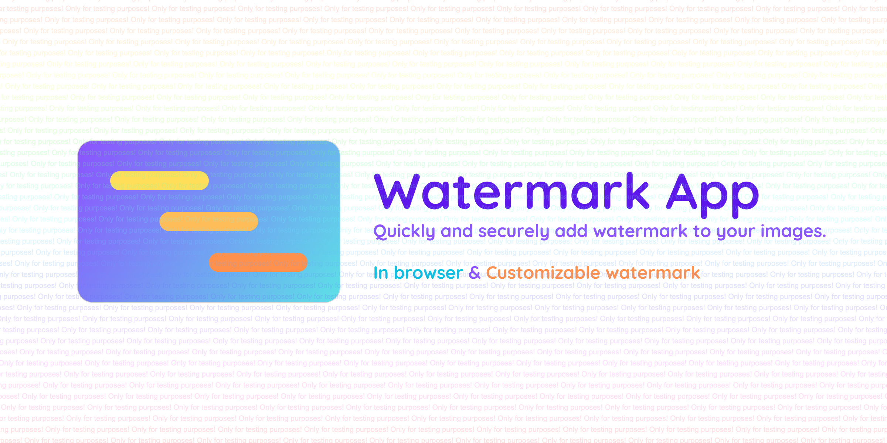

# Watermark App

Quickly and securely add watermark to your images.


## Features

- All client-side, no server involved
- PWA support, offline available
- Add watermark to multiple images at once
- Customizable watermark size, opacity, and luminance

## Examples

### Default


### Black


### Repeat



## Usage

Go to [Watermark App (watermark.csie.cool)](https://watermark.csie.cool/) and try it out!

You can build it yourself by following the instructions below.

## Build

You need:

- [Node.js 18+](https://nodejs.org/)
- [PNPM 8+](https://pnpm.io/)

Run the following commands to build the app.

```bash
pnpm i
pnpm build
```

The built files will be in the `build` folder, you can serve it with any static file server since it's all client-side.
